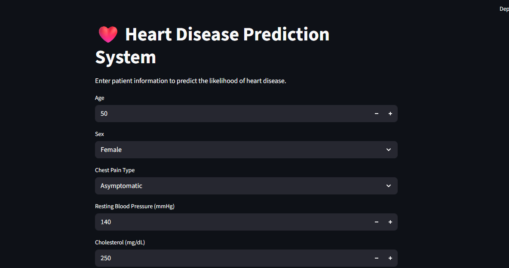

# Heart Disease Prediction System



The Heart Disease Prediction System is a Machine Learning application that predicts whether a patient is likely to have heart disease based on various medical attributes such as age, blood pressure, cholesterol level, chest pain type, ECG results, and heart rate.

The project uses a Random Forest Classifier trained on a heart disease dataset and provides predictions through an interactive Streamlit web application.


## 🎯 Objectives

* Analyze patient health data using Exploratory Data Analysis (EDA).
* Build a machine learning model for heart disease prediction.
* Evaluate model performance using classification metrics.
* Deploy the model using Streamlit for real-time predictions.


## 📊 Dataset Features

| Feature             | Description                                              |
| ------------------- | -------------------------------------------------------- |
| age                 | Age of the patient                                       |
| sex                 | Gender (Male/Female)                                     |
| chest pain type     | Type of chest pain experienced                           |
| resting bp s        | Resting blood pressure                                   |
| cholesterol         | Serum cholesterol level                                  |
| fasting blood sugar | Fasting blood sugar status                               |
| resting ecg         | Resting electrocardiogram results                        |
| max heart rate      | Maximum heart rate achieved                              |
| exercise angina     | Exercise-induced angina                                  |
| oldpeak             | ST depression induced by exercise                        |
| ST slope            | Slope of the peak exercise ST segment                    |
| target              | Heart disease status (0 = No Disease, 1 = Heart Disease) |


## 🤖 Machine Learning Model

### Algorithm Used

* Random Forest Classifier

### Model Parameters

```python
RandomForestClassifier(
    n_estimators=100,
    max_depth=10,
    random_state=42
)
```


## 📈 Model Performance

### Accuracy

```text
94.12%
```

### Classification Report

```text
Precision: 93%
Recall: 96%
F1-Score: 95%
```

### Confusion Matrix

```text
[[98  9]
 [ 5 126]]
```

The model demonstrates strong predictive performance and successfully identifies most heart disease cases.


## 🛠️ Technologies Used

* Python
* Pandas
* NumPy
* Matplotlib
* Seaborn
* Scikit-learn
* Joblib
* Streamlit

## 📁 Project Structure

```text
Heart Disease Prediction/
│
├── app.py
├── heart_disease_model.pkl
├── Heartdiseaseprediction.ipynb
├── dataset.csv
├── requirements.txt
├── README.md
└── Image.png
```

## 🚀 Installation

### Clone Repository

```bash
git clone https://github.com/malshiprabodha/Heart-Disease-Prediction-Model.git
cd Heart-Disease-Prediction-Model
```

### Install Dependencies

```bash
pip install -r requirements.txt
```

### Run Application

```bash
streamlit run app.py
```
## 🌐 Live Demo

```text
https://malshiprabodha-heart-disease-prediction-model-app-q2rwdg.streamlit.app/
```


